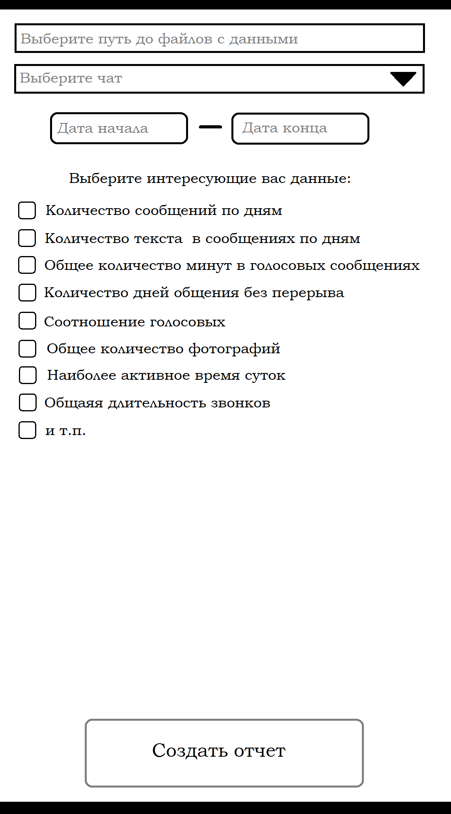

# tg-analyzer
## Постановка задачи
Предполагается создать анализатор telegram чатов, который бы сканировал чат/чаты и выдавал бы обобщенную статистику.
Например:
- График количества сообщений по дням
- График количества текста в сообщениях по дням
- Общее количество минут в голосовых сообщениях
- Средняя длительность голосовых
- Общее количество фотографий
- И т.п.
Предполагается следующий порядок действий:
1. Чтобы не создавать лишних проблем с уязвимостями приложения при подключении его к личному аккаунту telegram, было решено, что пользователь должен сам предварительно выгрузить их.
    - Это можно сделать через официальное приложение telegram. "Настройки" -> "Продвинутые настройки" -> "Экспорт данных из Telegram" -> "Машиночитаемый JSON"
2. Пользователь запускает приложение, выбирает интересующий его чат/чаты, период, за который он хочет посмотреть статистику, и интересующие его статистические показатели.
3. Приложение производит анализ JSON-файла и выдает интересующую информацию в формате HTML-файла со статистикой в виде графиков.
## Предполагаемые инструменты
- json - работа с данными telegram и их парсинг
- PyQt5/PySide2 - GUI
- Pandas и Mathplotlib/Seaborn - статистическая работа с данными, отрисовка графиков
- Jinja и yattag/xml.etree - построение отчета в формате HTML
## Макет GUI

